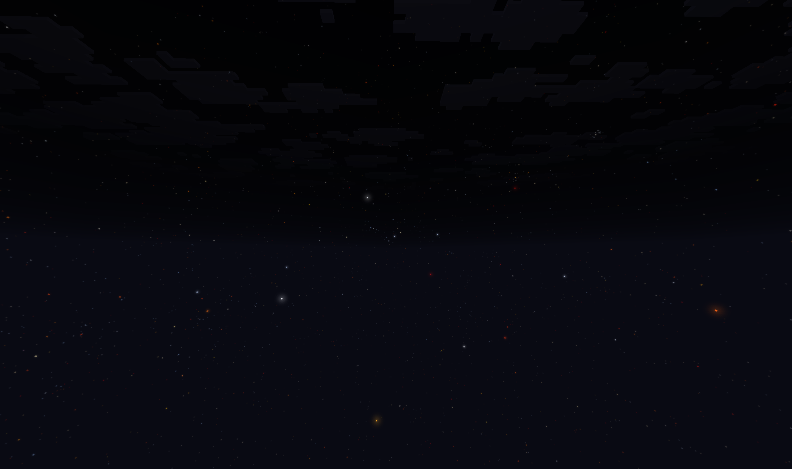

# ReadStar — NeoForge 26.1 天文模组



## Mod 特色

- **真实星表** — 基于 Gaia DR3（颜色） + BSC5（亮星回退）的 12,000+ 颗真实恒星，逐星独立亮度与光晕
- **真实天体力学** — 基于开普勒轨道方程的行星系统，支持任意深度嵌套
- **FOV 感知渲染** — 自定义着色器，FOV 变化时星星屏幕大小保持恒定
- **零代码扩展** — 放置 PNG 即可为任意天体添加 8 种月相纹理
- **服务端同步** — 天体配置由服务端统一管理，客户端自动同步

---

## 快速开始

```bash
./gradlew build          # 构建
./gradlew runClient      # 运行客户端
./gradlew runServer      # 运行服务端
```

模组通过**数据包** `data/readstar/celestial/system.json` 定义天体系统，通过**资源包** `assets/readstar/custom/stars/stars.json` 定义恒星目录。

配置文件修改后 F3+T 热重载即可生效；数据包修改需 `/reload` 或重启。

---

## 配置

配置文件：`run/config/readstar-common.toml`

| 配置项 | 默认值 | 说明 |
|--------|--------|------|
| `starCoreSize` | `0.648` | 星星核心 quad 大小乘数 |
| `starGlowSize` | `1.5` | 亮星光晕 quad 大小乘数 |
| `starFovCompensationStrength` | `0.8` | FOV 变化时星星**大小**补偿。`1.0` = 完全补偿，`0.0` = 无补偿 |
| `starFovBrightnessStrength` | `1.0` | FOV 缩小时星星**亮度**增强。`0.0` = 无效果 |
| `celestialApparentSizeFactor` | `4000.0` | 天体视大小计算因子 |
| `celestialApparentSizeMin` | `1.024` | 天体视大小下限 |

### FOV 感知渲染

星星使用自定义着色器，将星点拆为**位置**和**偏移**两个独立属性：

| 属性 | 含义 | 行为 |
|------|------|------|
| `Position` (vec3) | 天球上的坐标，4 顶点共享 | 正常走 MVP 投影，随 FOV 自然缩放 |
| `Offset` (vec3) | Billboard 角偏移，4 顶点各异 | 乘 `FovCompensation` 反补 |

补偿公式：`FovCompensation = tan(fov/2) / tan(35°) × strength + (1 - strength)`

着色器中：`worldPos = Position + Offset × FovCompensation`

### 逐星亮度

基于视星等 Vmag，alpha 和 RGB 独立衰减：

| 参数 | 公式 | 说明 |
|------|------|------|
| Alpha | `clamp(1 - max(0, Vmag-3)/12, 0.4, 1)` | Vmag ≤ 3 全亮 |
| RGB | `clamp(1 - max(0, Vmag-1)/19, 0.7, 1)` | Vmag ≤ 1 全亮 |
| 大小 | `clamp(1 - Vmag/12, 0.5, 1) × starCoreSize` | 越暗越小 |

光晕仅 Vmag < 2.0 渲染，分三级：`< 0.5 → 高 / < 1.5 → 中 / < 2.0 → 低`。

---

## 数据包 — 天体系统

**路径**: `data/readstar/celestial/system.json`

可放在 `saves/<世界>/datapacks/<你的数据包>/data/readstar/celestial/system.json` 或服务端 `world/datapacks/`。

### 结构

```json
{
  "System": {
    "<名称>": {
      "mass": <double>,
      "radius": <double>,
      "luminance": <int>,
      "axis": [<x>, <y>, <z>],
      "orbit": {
        "semiMajorAxis": <double>,
        "eccentricity": <double>,
        "inclination": <double>,
        "argumentOfPeriapsis": <double>,
        "longitudeOfAscendingNode": <double>,
        "initialMeanAnomaly": <double>
      },
      "children": { "<名称>": { ... } }
    }
  }
}
```

### 参数说明

| 字段 | 说明 |
|------|------|
| `mass` | 质量（kg）。0 = 固定于父节点位置 |
| `radius` | 半径（m）。视大小 = `max(1.024, radius / distance × factor)` |
| `luminance` | 自发光亮度 0~15。>0 被识别为恒星，子天体自动向上查找作为 `hostStar` |
| `axis` | 自转轴方向。全零默认 `(0,0,-1)` |
| `orbit.semiMajorAxis` | 半长轴（m）。0 = 不公转 |
| `orbit.eccentricity` | 偏心率。0 = 正圆 |
| `orbit.inclination` | 轨道倾角（弧度） |
| `orbit.argumentOfPeriapsis` | 近心点幅角（弧度） |
| `orbit.longitudeOfAscendingNode` | 升交点经度（弧度） |
| `orbit.initialMeanAnomaly` | 初始平近点角（弧度） |

名称大小写不敏感。`children: {}` 表示无子天体。嵌套深度不限。

### 完整示例

太阳 → 地球+火星 → 月球。数值采自真实太阳系。

```json
{
  "System": {
    "Sun": {
      "mass": 1.989e30, "radius": 6.957e8, "luminance": 15,
      "axis": [0, 0, 0],
      "orbit": { 
        "semiMajorAxis": 0, "eccentricity": 0, "inclination": 0, "argumentOfPeriapsis": 0, "longitudeOfAscendingNode": 0, "initialMeanAnomaly": 0 },
      "children": {
        "Earth": {
          "mass": 5.972e24, "radius": 6.371e6, "luminance": 0,
          "axis": [0, 0, 0],
          "orbit": { "semiMajorAxis": 1.496e11, "eccentricity": 0.0167, "inclination": 0, "argumentOfPeriapsis": 1.796, "longitudeOfAscendingNode": 0, "initialMeanAnomaly": 6.240 },
          "children": {
            "Moon": {
              "mass": 7.342e22, "radius": 1.737e6, "luminance": 0,
              "axis": [0, 0, 0.5],
              "orbit": { "semiMajorAxis": 3.844e8, "eccentricity": 0.0549, "inclination": 0.0899, "argumentOfPeriapsis": 0, "longitudeOfAscendingNode": 0, "initialMeanAnomaly": 0 },
              "children": {}
            }
          }
        },
        "Mars": {
          "mass": 6.417e23, "radius": 3.390e6, "luminance": 0,
          "axis": [0, 0, 0],
          "orbit": { "semiMajorAxis": 2.279e11, "eccentricity": 0.0934, "inclination": 0.0323, "argumentOfPeriapsis": 0, "longitudeOfAscendingNode": 0.865, "initialMeanAnomaly": 0 },
          "children": {}
        }
      }
    }
  }
}
```

### 继承与时间

- `hostStar`：递归向上查找首个 `luminance > 0` 的祖先
- 位置 = `parent.position + orbit(parent.mass, gameTime)`
- 根节点固定于 `(0, 0, 0)`
- `gameTime` 控制公转，`daylightTime`（0~24000）控制自转天顶
- 月相由观测者-卫星-恒星几何关系自动计算

### 太阳纹理

单张贴图，放 `assets/<命名空间>/textures/environment/celestial/luminous/<名称>.png`。`readstar:luminous/white_sun.png` 仅作为占位示例，替换为自己的贴图即可。

---

## 资源包

### 恒星目录

**路径**: `assets/readstar/custom/stars/stars.json`

#### 数据来源

星表由 `.data/` 目录下脚本自动生成：

| 脚本 | 数据源 | 输出 |
|------|--------|------|
| `generate_stars.py` | BSC5 亮星星表 | `stars_named.json` (361 IAU命名) + `stars_numbered.json` (8043 HR编号) |
| `gaia_download.py` | Gaia Archive TAP API | `gaia_bright_with_teff.vot` (含有效温度) |
| `gaia_to_stars.py` | Gaia DR3 + BSC5 回退 | `stars_gaia_named.json` (361 颗) + `stars_gaia_numbered.json` (11809 颗) |

**颜色算法**：优先使用 Gaia GSP-Phot 有效温度 → Planckian 黑体辐射 → sRGB；无温度数据时回退到 bp_rp 色指数分段映射。最亮 12 颗星（天狼星、织女星等）因 Gaia 探测器饱和，保留 BSC5 数据。

#### JSON 格式

```json
{
  "Stars": [
    {
      "name": "Sirius",
      "position": [-0.1875, -0.2876, 0.9392],
      "Vmag": -1.46,
      "color": 4294967295
    }
  ]
}
```

| 字段 | 说明 |
|------|------|
| `name` | 标识符（保留字段，无运行时作用） |
| `position` | 单位球面方向 `[x,y,z]`，渲染时归一化到 100 距离。Y=北天极 |
| `Vmag` | 视星等（Gaia G 波段 或 BSC5 V 波段）。决定光晕等级和亮度衰减 |
| `color` | ARGB 颜色值，作为图集精灵生成的 key |

---

### 自定义月亮贴图

核心亮点：**为任意天体添加 8 种月相纹理，只需放置 PNG，零代码**。

#### 目录结构

```
assets/<命名空间>/textures/environment/celestial/non-luminous/<天体名称>/
```

- `<天体名称>` 必须与 `system.json` 中名称**小写一致**
- 每个天体需**恰好 8 张 PNG**，文件名固定：

| 文件名 | 月相 |
|--------|------|
| `full_moon.png` | 满月 |
| `waning_gibbous.png` | 亏凸月 |
| `third_quarter.png` | 下弦月 |
| `waning_crescent.png` | 残月 |
| `new_moon.png` | 新月 |
| `waxing_crescent.png` | 蛾眉月 |
| `first_quarter.png` | 上弦月 |
| `waxing_gibbous.png` | 盈凸月 |

#### 贴图要求

| 规格 | 要求 |
|------|------|
| 格式 | PNG，RGBA 32-bit |
| 尺寸 | 建议 16×16 或 32×32 |
| 边缘 | 透明（alpha=0） |
| 着色 | 自带颜色，不会被额外染色 |

#### 示例：添加木星

```
assets/readstar/textures/environment/celestial/non-luminous/jupiter/
├── full_moon.png
├── waning_gibbous.png
├── third_quarter.png
├── waning_crescent.png
├── new_moon.png
├── waxing_crescent.png
├── first_quarter.png
└── waxing_gibbous.png
```

同时在 `system.json` 中定义木星的轨道参数（见上方完整示例）。

#### 原理

1. `textures/environment/celestial/` 下 PNG 被 Minecraft 图集系统自动扫描
2. `ReadstarSkyRenderer` 构造函数按子目录名自动分组构建 GPU 缓冲
3. 运行时按 `body.name` 匹配纹理组

其他 Mod 可通过资源包优先级替换纹理（同名文件覆盖即可）。

---

### 精灵与图集

#### 星星图集

`assets/readstar/atlases/star.json` 声明 `readstar:star` 图集源。运行时从 `stars.json` 读所有 `color` 值，基于底模逐像素染色：

| 底模 | 路径 | 说明 |
|------|------|------|
| `star_base.png` | `textures/environment/star/` | 核心（32×32 RGBA） |
| `star_glow_low.png` | 同上 | 低级光晕 |
| `star_glow_med.png` | 同上 | 中级光晕 |
| `star_glow_high.png` | 同上 | 高级光晕 |

每种颜色生成 4 精灵：`color_{c}`、`glow_low_{c}`、`glow_med_{c}`、`glow_high_{c}`。

底模要求：RGBA 32-bit、32×32、边缘纯黑、光晕亮度压制 0.35×

#### 天体图集

`assets/readstar/atlases/celestial.json` 使用 `minecraft:directory` 源，自动扫描所有命名空间 `textures/environment/celestial/`。

---

## 网络同步

服务端加载 `data/readstar/celestial/*.json`，通过 `readstar:planet_system` 包广播到客户端。客户端 `CelestialBodyManager.initializeFromJson()` 解析并构建天体树。

---

## 构建 & 故障排查

```bash
./gradlew build          # 构建 JAR
./gradlew runData        # 数据生成（图集配置）
./gradlew runClient      # 运行客户端
./gradlew runServer      # 运行服务端
```

产物：`build/libs/readstar-*.jar`

| 现象 | 检查点 |
|------|--------|
| 星星紫黑贴图 | `star_base.png` 是否为 32-bit RGBA |
| 月相紫黑 | 对应 PNG 缺失或文件名拼写错误 |
| 天体不显示 | `system.json` 中是否有 `hostStar`（自身或祖先 luminance>0） |
| 数据包未生效 | `/reload` 或重启 |
| 资源包未更新 | F3+T |
| FOV 补偿不生效 | 配置文件 `starFovCompensationStrength` 是否 > 0 |

---

© 2026 FrozenStream. 基于 NeoForge 构建，遵循 MIT 许可证。
