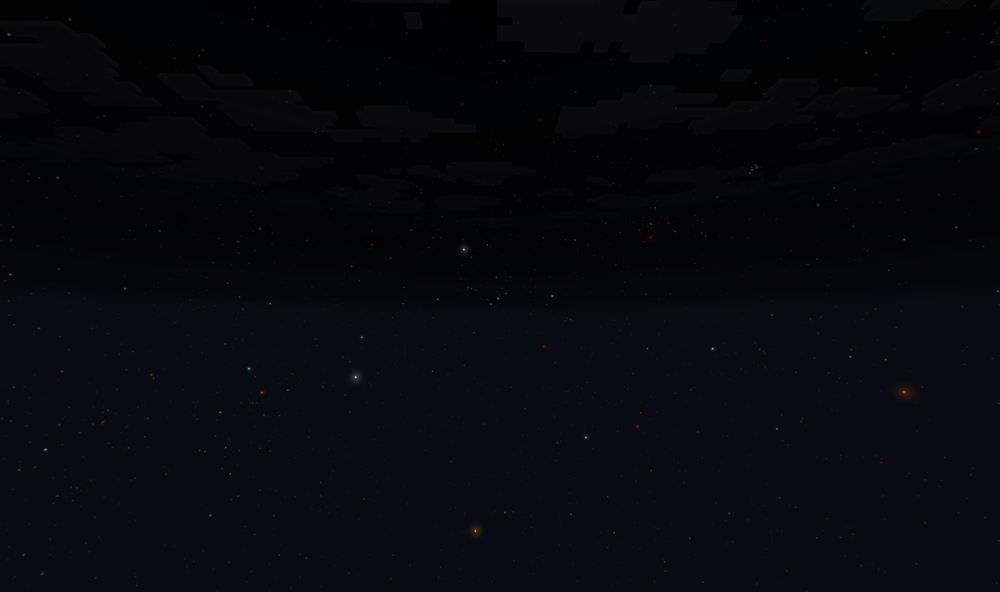

# ReadStar — NeoForge 26.1 天文模组



## Mod 特色

- **真实星表** — 基于 Gaia DR3（颜色） + BSC5（亮星回退）的 12,000+ 颗真实恒星，逐星独立亮度与光晕
- **真实天体力学** — 基于开普勒轨道方程的行星系统，支持任意深度嵌套
- **大气散射模拟** — 基于 HSV 色彩空间的大气颜色与光晕计算，支持全天空叠加和天体辉光
- **彗星渲染** — 贝塞尔曲线尘埃尾 + 离子尾双尾结构，带动态摆动效果
- **FOV 感知渲染** — 自定义着色器，FOV 变化时星星屏幕大小保持恒定
- **零代码扩展** — 放置 PNG 即可为任意天体添加 8 种月相纹理
- **服务端同步** — 天体配置由服务端统一管理，客户端自动同步

---

## 快速开始

**数据包** `data/readstar/celestial/system.json` 定义天体系统，
**资源包** `assets/readstar/custom/stars/stars.json` 定义恒星目录。

配置文件修改后 F3+T 热重载即可生效；数据包修改需 `/reload` 或重启。

---

## 配置

配置文件：`run/config/readstar-common.toml`

| 配置项 | 默认值 | 说明 |
|--------|--------|------|
| `starCoreSize` | `0.648` | 星星核心 quad 大小乘数 |
| `starGlowSize` | `1.5` | 亮星光晕 quad 大小乘数 |
| `starFovCompensationStrength` | `0.8` | FOV 变化时星星**大小**补偿。`1.0` = 完全补偿，`0.0` = 无补偿 |
| `starFovBrightnessStrength` | `1.0` | FOV 缩小时星星**亮度**增强。`0.0` = 无效果 |
| `celestialApparentSizeFactor` | `4000.0` | 天体视大小计算因子 |
| `celestialApparentSizeMin` | `1.024` | 天体视大小下限 |

### FOV 感知渲染

星星使用自定义着色器，将星点拆为**位置**和**偏移**两个独立属性：

| 属性 | 含义 | 行为 |
|------|------|------|
| `Position` (vec3) | 天球上的坐标，4 顶点共享 | 正常走 MVP 投影，随 FOV 自然缩放 |
| `Offset` (vec3) | Billboard 角偏移，4 顶点各异 | 乘 `FovCompensation` 反补 |

补偿公式：`FovCompensation = tan(fov/2) / tan(35°) × strength + (1 - strength)`

着色器中：`worldPos = Position + Offset × FovCompensation`

### 逐星亮度

基于视星等 mag，alpha 和 RGB 独立衰减：

| 参数 | 公式 | 说明 |
|------|------|------|
| Alpha | `10^(-0.05 × max(0, mag-1))` | 普森公式，mag≤1 全亮 |
| RGB | 同 Alpha | 颜色和透明度同衰减 |
| 大小 | `max(10^(-0.05 × max(0, mag-2)), 0.3) × starCoreSize` | 暗星保持最小可见尺寸 |

光晕仅 mag < 2.0 渲染，分三级：`< 0.5 → 高 / < 1.5 → 中 / < 2.0 → 低`。

---

## 数据包 — 天体系统

**路径**: `data/readstar/celestial/system.json`

可放在 `saves/<世界>/datapacks/<你的数据包>/data/readstar/celestial/system.json` 或服务端 `world/datapacks/`。

### 结构

```json
{
  "System": {
    "<名称>": {
      "mass": <double>,
      "radius": <double>,
      "luminance": <int>,
      "unstableDirtySnowball": <bool>,
      "hasAtmosphere": <bool>,
      "atmosphereHSV": <int>,
      "starHSV": <int>,
      "axis": [<x>, <y>, <z>],
      "orbit": {
        "semiMajorAxis": <double>,
        "eccentricity": <double>,
        "inclination": <double>,
        "argumentOfPeriapsis": <double>,
        "longitudeOfAscendingNode": <double>,
        "initialMeanAnomaly": <double>
      },
      "children": { "<名称>": { ... } }
    }
  }
}
```

### 参数说明

| 字段 | 说明 |
|------|------|
| `mass` | 质量（kg）。0 = 固定于父节点位置 |
| `radius` | 半径（m）。视大小 = `max(1.024, radius / distance × factor)` |
| `luminance` | 自发光亮度 0~15。>0 被识别为恒星，子天体自动向上查找作为 `hostStar` |
| `unstableDirtySnowball` | 彗星标记。`true` 时渲染双尾结构 |
| `hasAtmosphere` | 是否有大气层（控制大气叠加和光晕渲染） |
| `atmosphereHSV` | 大气 HSV 颜色，打包 int（H<<16 \| S<<8 \| V）。H=色相, S=饱和度, V=浓度(0~255) |
| `starHSV` | 天体自身颜色，同上编码。发光体=发射色，非发光体=表面反射色 |
| `axis` | 自转轴方向。全零默认 `(0,0,-1)` |
| `orbit.semiMajorAxis` | 半长轴（m）。0 = 不公转 |
| `orbit.eccentricity` | 偏心率。0 = 正圆 |
| `orbit.inclination` | 轨道倾角（弧度） |
| `orbit.argumentOfPeriapsis` | 近心点幅角（弧度） |
| `orbit.longitudeOfAscendingNode` | 升交点经度（弧度） |
| `orbit.initialMeanAnomaly` | 初始平近点角（弧度） |

名称大小写不敏感。`children: {}` 表示无子天体。嵌套深度不限。

### 继承与时间

- `hostStar`：递归向上查找首个 `luminance > 0` 的祖先
- 位置 = `parent.position + orbit(parent.mass, gameTime)`
- 根节点固定于 `(0, 0, 0)`
- `gameTime` 控制公转，`daylightTime`（0~24000）控制自转天顶
- 月相由观测者-卫星-恒星几何关系自动计算

### 大气系统

每个天体可定义大气颜色（HSV）和自身颜色（HSV），均为打包 int：

```
atmosphereHSV / starHSV = (H << 16) | (S << 8) | V
```

| 分量 | 位 | 范围 | 含义 |
|------|-----|------|------|
| H (Hue) | 16-23 | 0~255 | 色相（0=红 → 255 循环回红） |
| S (Saturation) | 8-15 | 0~255 | 饱和度（0=灰白, 255=纯色） |
| V (Value) | 0-7 | 0~255 | 浓度/亮度（atmosphereHSV=大气浓度, starHSV=天体亮度） |

### 纹理目录

天体纹理按类别分目录存放，由 `celestial.json` 图集自动扫描：

```
assets/<命名空间>/textures/environment/celestial/
├── luminous/<名称>.png       # 发光天体（单张贴图，无月相）
├── non-luminous/<名称>/      # 非发光天体（8 月相 PNG）
└── halo.png                  # 光晕纹理（灰度径向衰减）
```

发光天体只需一张 PNG，放 `luminous/` 目录。非发光天体需 8 张月相 PNG，放 `non-luminous/<名称>/`。

---

## 资源包

### 恒星目录

**路径**: `assets/readstar/custom/stars/stars.csv`

| 字段 | 说明 |
|------|------|
| `name` | 标识符（保留字段，无运行时作用） |
| `position` | 单位球面方向 `[x,y,z]`，渲染时归一化到 100 距离。Y=北天极 |
| `mag` | 视星等（Gaia G 波段 或 BSC5 V 波段）。决定光晕等级和亮度衰减 |
| `color` | ARGB 颜色值，作为图集精灵生成的 key |

---

### 自定义月亮贴图

核心亮点：**为任意天体添加 8 种月相纹理，只需放置 PNG，零代码**。

#### 目录结构

```
assets/<命名空间>/textures/environment/celestial/non-luminous/<天体名称>/
```

- `<天体名称>` 必须与 `system.json` 中名称**小写一致**
- 每个天体需**恰好 8 张 PNG**，文件名固定：

| 文件名 | 月相 |
|--------|------|
| `full_moon.png` | 满月 |
| `waning_gibbous.png` | 亏凸月 |
| `third_quarter.png` | 下弦月 |
| `waning_crescent.png` | 残月 |
| `new_moon.png` | 新月 |
| `waxing_crescent.png` | 蛾眉月 |
| `first_quarter.png` | 上弦月 |
| `waxing_gibbous.png` | 盈凸月 |

#### 贴图要求

| 规格 | 要求 |
|------|------|
| 格式 | PNG，RGBA 32-bit |
| 尺寸 | 建议 16×16 或 32×32 |
| 边缘 | 透明（alpha=0） |
| 着色 | 自带颜色，不会被额外染色 |

#### 示例：添加木星

```
assets/readstar/textures/environment/celestial/non-luminous/jupiter/
├── full_moon.png
├── waning_gibbous.png
├── third_quarter.png
├── waning_crescent.png
├── new_moon.png
├── waxing_crescent.png
├── first_quarter.png
└── waxing_gibbous.png
```

同时在 `system.json` 中定义木星的轨道参数（见上方完整示例）。

#### 原理

1. `textures/environment/celestial/` 下 PNG 被 Minecraft 图集系统自动扫描
2. `ReadstarSkyRenderer` 构造函数按子目录名自动分组构建 GPU 缓冲
3. 运行时按 `body.name` 匹配纹理组

其他 Mod 可通过资源包优先级替换纹理（同名文件覆盖即可）。

---

### 精灵与图集

#### 星星图集

`assets/readstar/atlases/star.json` 声明 `readstar:star` 图集源。运行时从 `stars.json` 读所有 `color` 值，基于底模逐像素染色：

| 底模 | 路径 | 说明 |
|------|------|------|
| `star_base.png` | `textures/environment/star/` | 核心（32×32 RGBA） |
| `star_glow_low.png` | 同上 | 低级光晕 |
| `star_glow_med.png` | 同上 | 中级光晕 |
| `star_glow_high.png` | 同上 | 高级光晕 |

每种颜色生成 4 精灵：`color_{c}`、`glow_low_{c}`、`glow_med_{c}`、`glow_high_{c}`。

#### 天体图集

`assets/readstar/atlases/celestial.json` 使用 `minecraft:directory` 源，自动扫描所有命名空间 `textures/environment/celestial/`。

---

## 网络同步

服务端加载 `data/readstar/celestial/*.json`，通过 `readstar:planet_system` 包广播到客户端。客户端 `CelestialBodyManager.initializeFromJson()` 解析并构建天体树。

---

## 命令

| 命令 | 参数 | 说明 |
|------|------|------|
| `/readstar mag <0~10>` | `mag` — 视星等上限 | 按 mag 阈值重建星星渲染缓冲，默认 `6.0`。 |

---

© 2026 FrozenStream. 基于 NeoForge 构建，遵循 MIT 许可证。
